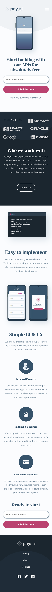

# Frontend Mentor - PayAPI multi-page website solution

This is a solution to the [PayAPI multi-page website challenge on Frontend Mentor](https://www.frontendmentor.io/challenges/payapi-multipage-website-FDLR1Y11e). Frontend Mentor challenges help you improve your coding skills by building realistic projects. 

## Table of contents

- [Overview](#overview)
  - [The challenge](#the-challenge)
  - [Screenshot](#screenshot)
  - [Links](#links)
- [My process](#my-process)
  - [Built with](#built-with)
  - [What I learned](#what-i-learned)
  - [Continued development](#continued-development)
  - [Useful resources](#useful-resources)
- [Author](#author)
- [Acknowledgments](#acknowledgments)

## Overview

### The challenge

Users should be able to:

- View the optimal layout for each page depending on their device's screen size
- See hover states for all interactive elements throughout the site
- Receive an error message when the contact form is submitted if:
  - The `Name`, has less than 3 or more than 30 characters "First name must be between 3 and 30"
  - The  `Message` field is empty , has less than 5 or more than 50 characters
       should show "First name must be between 3 and 50"
  - The `Email Address` is not formatted correctly should show "Please use a valid email address"
  - The `Title` has less than 2 characters, "Title  must be between 2 and 8"
  - The `Company` has less than 3 characters , "Company name must not be empty"

### Screenshot (Design preview)

### Links

- Live URL: [Payapi](https://payapi-multipage-website.netlify.app/)

## My process

### Built with

- Semantic HTML5 markup
- CSS custom properties
- React components
- Sass modules
- Flexbox
- CSS Grid
- Mobile-first workflow
- Responsive web design

### What I learned

**setting dart sass in react app**
[set up instructions](https://medium.com/nerd-for-tech/add-sass-to-your-react-app-in-2021-here-is-how-c7260c323a5a)

**centering an absolute positioned element**
  - Add left: 50% to the element that you want to center. You will notice that this aligns the left edge of the child    element with the 50% line of the parent.
  - Add a negative left margin that is equal to half the width of the element. This moves us back onto the halfway mark.
  - Next, we’ll do a similar process for the vertical axis. Add top: 50% to the child
  - And then add a negative top margin equal to half its height.

[how to center an absolute positioned element](https://thoughtbot.com/blog/positioning)

### Continued development

- improvement form validation
- checkbox to match design - by creating a custom checkbox

### Useful resources

- [React router dom](https://reactrouter.com/web/guides/quick-start) - navigation between pages

## Author

- Website - [Chamu Mutezva](https://github.com/ChamuMutezva)
- Frontend Mentor - [@ChamuMutezva](https://www.frontendmentor.io/profile/ChamuMutezva)
- Twitter - [@ChamuMutezva](https://twitter.com/ChamuMutezva)

## Acknowledgments

Frontend Mentor community leaders for providing a platform to engage with fellow learners and mentors. This makes the learning exciting.
